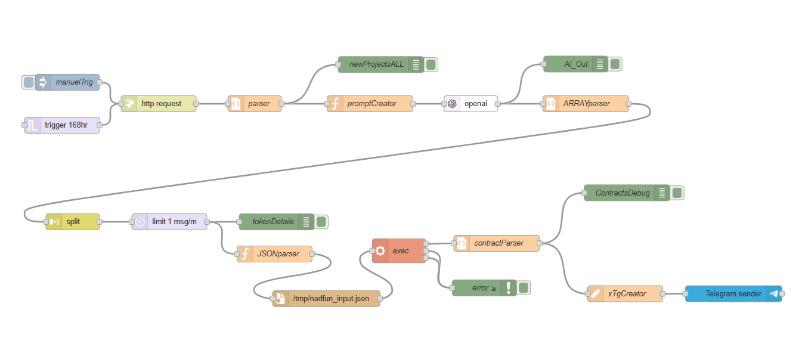

# Scout Agent  
## AI-Powered Weekly Token Discovery (Node-RED)

Scout Agent is an **AI-driven token discovery and analysis pipeline** built on **Node-RED**.

It continuously tracks newly launched tokens, analyzes on-chain signals, ranks the most promising projects, and outputs the **Top 5 emerging tokens each week**.  
Optionally, it can **create tokens via nad.fun** using a custom Node.js script.

---

## Node-RED Flow

---

## High-Level Architecture

1. **Trigger**
   - Manual trigger
   - Scheduled trigger (every 168 hours / weekly)

2. **Data Collection**
   - HTTP requests to fetch newly deployed contracts / token data
   - Raw response parsing and normalization

3. **AI Analysis**
   - Prompt generation
   - OpenAI analysis
   - Ranking & filtering of projects

4. **Post-Processing**
   - Array splitting & rate limiting
   - Token-level enrichment
   - JSON transformation

5. **Token Creation (Optional)**
   - Uses `nadfun-create.mjs`
   - Powered by the `nad.fun` npm library
   - Executed via Node-RED `exec` node

6. **Distribution**
   - Telegram message creation
   - Automated Telegram delivery

---

## Repository Structure

.
├── flows.json
├── nadfun-create.mjs
├── img/
│ └── flow.png
└── README.md

> ⚠️ **Security Note**  
> This repository does NOT include:
> - `flows_cred.json`
> - API keys
> - Private keys
> - Telegram bot tokens  
>
> These must be provided via environment variables or Node-RED credentials.

---

## Requirements

- Node.js **v18+**
- Node-RED **v3+**
- npm
- Linux / Raspberry Pi recommended
- Access to:
  - OpenAI API
  - Telegram Bot API
  - nad.fun (wallet + permissions)

---

## Setup Overview

1. Install Node-RED and access the editor UI  
2. Import the provided `flows.json` file  
3. Install required Node-RED nodes and dependencies  
4. Place `nadfun-create.mjs` in an executable location  
5. Configure required environment variables  
6. Run the agent manually or on a weekly schedule  

---

## Running the Agent

- **Manual run:** use the `manualTrig` node
- **Automated run:** `trigger 168hr` node (weekly)

The final ranked output is delivered via Telegram.

---

## Disclaimer

This project is for research and experimentation purposes only.  
Token creation involves financial and legal risk.  
Use at your own discretion.

---

## License

MIT
